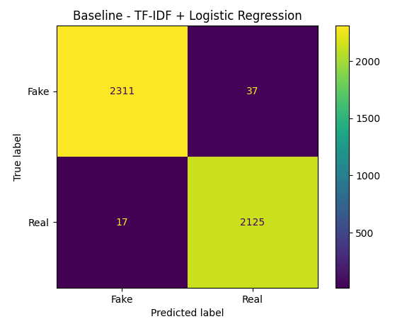
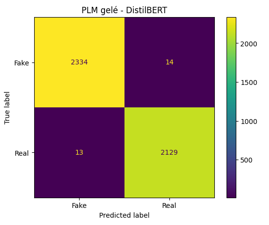

# Compte rendu — TP1 : Détection de Fake News avec un PLM

**Nom et prénom :** Oumayma Zerrik  
**Dataset choisi :** Option A — Fake and Real News Dataset (ISOT)  
**PLM utilisé :** DistilBERT (`distilbert-base-uncased`)

---

## 1. Résultats

| Approche | Accuracy | F1-score | Temps | GPU |
|---|---:|---:|---:|---|
| TF-IDF + Logistic Regression | 0.987973 | 0.987454 | 89.42 s | Non |
| DistilBERT gelé + Logistic Regression | 0.993987 | 0.993699 | 233.10 s | T4 |
| DistilBERT Fine-tuning | 0.999555 | 0.999533 | 369.80 s (~6.16 min) | T4 |

---

## 2. Matrices de confusion

### Baseline — TF-IDF + Logistic Regression



### PLM gelé — DistilBERT + Logistic Regression



---

## 3. Questions

### Q1 — Les classes sont-elles équilibrées ? Quel impact sur le choix de la métrique ?

Oui, les classes sont assez équilibrées.

On peut donc utiliser l'Accuracy pour évaluer le modèle.  
J'ai aussi utilisé le F1-score pour prendre en compte à la fois la précision et le rappel.

---

### Q2 — Quel score obtient la baseline TF-IDF + Logistic Regression ?

La baseline donne :

- **Accuracy : 98.80 %**
- **F1-score : 98.75 %**

Donc même avec une méthode simple comme TF-IDF + Logistic Regression, on obtient déjà de très bons résultats.

---

### Q3 — PLM gelé vs baseline : quel gain ? Pourquoi les embeddings contextuels aident-ils ?

La baseline donne un F1-score de **98.75 %**, alors que DistilBERT gelé donne **99.37 %**.

Le gain est donc d'environ **0.62 point de F1**.

DistilBERT donne de meilleurs résultats car il prend en compte le contexte des mots, contrairement à TF-IDF qui se base surtout sur l'importance des mots dans les textes.

---

### Q4 — Fine-tuning vs PLM gelé : quel gain ? À quel coût ?

DistilBERT gelé donne un F1-score de **99.37 %**, alors que le fine-tuning donne **99.95 %**.

Le gain est donc d'environ **0.58 point de F1**.

Par contre, le fine-tuning prend plus de temps :

- **DistilBERT gelé : 233.10 s**
- **Fine-tuning : 369.80 s (~6.16 min)**

Le fine-tuning donne donc de meilleurs résultats, mais demande plus de calcul et nécessite un GPU.

---

### Q5 — Matrice de confusion : quelles classes se confondent ? Donnez 2 exemples d'erreurs et une hypothèse.

Les matrices de confusion montrent qu'il y a très peu d'erreurs de classification.

On observe que certains articles Fake peuvent être classés comme Real et certains articles Real peuvent être classés comme Fake.

Je pense que certaines erreurs peuvent venir du fait que des Fake News ont parfois un style d'écriture très proche des vraies informations. Le modèle peut donc avoir du mal à les différencier.

---

### Q6 — Quel modèle choisiriez-vous pour la production, et pourquoi ?

Les résultats sont :

| Modèle | F1-score | Temps | GPU |
|---|---:|---:|---|
| TF-IDF + LR | 98.75 % | 89.42 s | Non |
| DistilBERT gelé + LR | 99.37 % | 233.10 s | T4 |
| DistilBERT Fine-tuning | 99.95 % | 369.80 s | T4 |

Si on veut un modèle simple, rapide et moins coûteux, **TF-IDF + Logistic Regression** est un bon choix.

Si on cherche la meilleure performance, **DistilBERT fine-tuné** donne le meilleur résultat avec un F1-score de **99.95 %**.

---

### Q7 — Comment avez-vous évité le sur-apprentissage et la fuite test-in-train ?

J'ai séparé les données en :

- **80 % Train**
- **10 % Validation**
- **10 % Test**

J'ai aussi utilisé une seed fixe :

```python
SEED = 42
```

Pour TF-IDF, j'ai utilisé `fit_transform()` seulement sur le Train et `transform()` sur Validation et Test.

Pour le fine-tuning, j'ai surveillé la Training Loss et la Validation Loss :

| Epoch | Training Loss | Validation Loss | F1 |
|---:|---:|---:|---:|
| 1 | 0.005487 | 0.001630 | 0.999533 |
| 2 | 0.002022 | 0.000930 | 0.999767 |
| 3 | 0.000068 | 0.000697 | 0.999767 |

La Validation Loss continue à diminuer, donc je n'ai pas observé de sur-apprentissage clair pendant les 3 epochs.

---

## 4. Décision et justification

Les trois modèles donnent de très bons résultats.

**TF-IDF + Logistic Regression** est le plus simple et le plus rapide.

**DistilBERT fine-tuné** donne le meilleur F1-score avec **99.95 %**, mais il demande plus de ressources.

Donc, si on cherche la simplicité et la rapidité, on peut choisir TF-IDF + Logistic Regression.

Si on cherche la meilleure performance, on peut choisir DistilBERT fine-tuné.

---

## 5. Limites et pistes d'amélioration

Les résultats sont très élevés, mais le dataset ISOT peut contenir des différences de style ou de source entre les Fake News et les Real News.

Le modèle peut donc apprendre ces différences au lieu de vraiment comprendre si une information est vraie ou fausse.

Pour améliorer le projet, on peut :

- tester le modèle sur des articles provenant de nouvelles sources ;
- analyser davantage les erreurs de classification ;
- tester d'autres modèles pré-entraînés ;
- comparer les résultats avec d'autres datasets.
